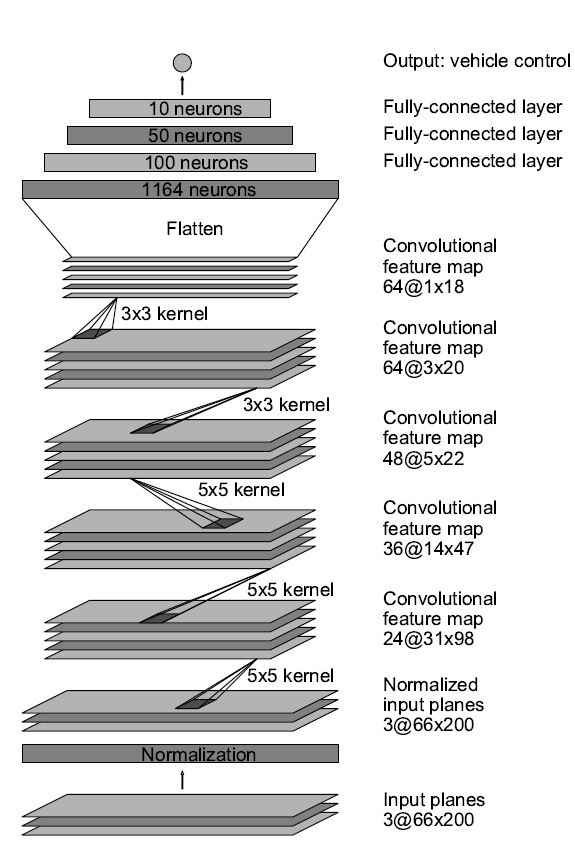

[gif1]: ./Gif/ScreenCaptureProject2.gif
[image1]: ./Figures/NVIDIA.jpg

# Behavioral Cloning Implementation in Keras
**Project Overview:** With in this projet the objective to drive a car aunomostly around a track using a deep neural network. The netural network is trained to predict the suitable steering angles based on the images that are available from the three cameras in fornt of the car. The training data set is collected by driving the car manually around the track and recording the images from the cameras as the input feature and the steering angles as the labels. The outline of the project is:

* Data collection and Visualization
* Data distribution correction
* Data Augmentation and adding the data from right and left cameras
* Normalization and Pre-processing
* Deep Netural Network Artchitercture
* Neural Network Training

# 1. Data Collection and Visualization
Probably the most important part of this project which is playing a major role in the performance of the trained model is the data collection. In fact the trained deep neural network will learn and clone the driving pattern of the driver from the collected data. Therefore, if the quality of the data is not good the network will not be able to navigate the car sucessfully around the track.

* Summary of the collected data
1. Data available from udacity
2. Three rounds driving in the center of the roud in forward direction
3. Three rounds driving in the center of the roud in oposite direction
4. One round recovery from the off-center condition in forward direction
5. One round recovery from the off-center condition in oposite direction
6. One round just passing through the turns in forward direction
7. One round just passing through the turns in oposite direction

I combined all these collected data from the data provided by udacity, and in total it was about 1.5GB of data. In my experince collecting more data was the key to solve the problem. The more data I collected the model was generalzing better.

Figures below shows a few examples of the collected data.

# 2. Data distribution correction
I deep learning applicatins having a good understanding of the statistics of the training data can be useful to train a efficient model. Figure below shows the histogram of the distribution of the **steering angles**

As it is clear the steering angles are concentrated to value **zero** because most parts of the track are straigh. Using this data set to train the model will result to a model which is highly biased to **zero** steering angles, in other words the model will be more accurate in predicting **zero** steering angles, and it will be facing difficulties while predicting the steering angles while entering the turns. In order to overcome this draw back I excluded some of the data points associated with the zero steering angle. I excluded half of the data points with zero steering angle randomly. The distribution of the new data set is as shown in figure below.

Using this data distribution the model will be less biased towards **zero steering angles**

# 3. Data Augmentation and adding the data from right and left cameras
Other than collecting data new data points can be obtained by data augmnetaion and also using the images from the left and right cameras. In order to use the images from the left and right cameras the steering agnles are correted using a correction factor which is tuned to **0.15**. In other words the **0.15** is added to the angles associated with the left images and **0.15** is sustracted from the images from the right cameras. The images from the side cameras can be useful to train the model to recover from the sides of the track. Moreover,in order to obtain a sytemtrix distribution of the data the images are fliped and the negation of the steering angles are used.

# 4. Normalization and Pre-Processing
Several stages of data normalization and Pre-processing are used to enhcance the pefromace of the model which will be discussed in this section:

* 1. Converting BGR to YUV: 
The deep neural network model that is used in this project is based on the YUV color space while the images captured by the  cameras are in RGB and cv2 reads the images in BGR. Therefore, in the data generator the images are converted from BGR to YUV.

* 2. Cropping: 
The top section of the images containes mostly the skk, background and other information which does not seem to be useful for predicting the steering angles. Moreover, some of the bottom pixels are associated with the hood of the car. These sections are cropped with in the the deep neural network implementation in keras to make sure that the training and prediction stage are both neglecting the undesired sections of the images.

* 3. Normalization:
In deep learning projects it is always suitable to normalize the data to have zeros mean and standard deviation of 1. Having a normalized data set will make the opmization procedure easired to optimizers such as gradient decent, stochastic gradient decent or Adam optimizer.

# 4. Deep neural network architerture

With in this project the deep neural network from the End to End Learning for Self-Driving Cars by [NVIDIA](https://images.nvidia.com/content/tegra/automotive/images/2016/solutions/pdf/end-to-end-dl-using-px.pdf) has been adopted as below.

The network is altered by adding two dropout layers for first two fully connected layers and the keep_prob is set to 0.5. Adding these dropout layers will prevent the model from over fitting, which enables the model to generalize better.

![alt text][gif1]
