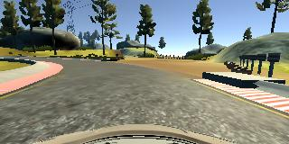
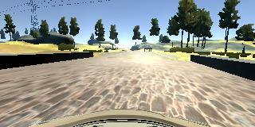

[gif1]: ./Drive.gif
[image1]: ./Figures/hist1.jpg
[image2]: ./Figures/hist2.jpg
[image3]: ./Figures/NVIDIA.jpg

# Behavioral Cloning Implementation in Keras

![alt text][gif1]

**Project Overview:** Within this project the objective to drive a car autonomously around a track using a deep neural network. The neutral network is trained to predict the suitable steering angles based on the images that are available from the three cameras in front of the car. The training data set is collected by driving the car manually around the track and recording the images from the cameras as the input feature and the steering angles as the labels. The outline of the project is:

* Data collection and Visualization
* Data distribution correction
* Data Augmentation and adding the data from right and left cameras
* Normalization and Pre-processing
* Deep Neural Network Architecture
* Neural Network Training
* Implementation notes and summary

## 1. Data Collection and Visualization
Probably the most important part of this project which is playing a major role in the performance of the trained model is the data collection. In fact the trained deep neural network will learn and clone the driving pattern of the driver from the collected data. Therefore, if the quality of the data is not good the network will not be able to navigate the car successfully around the track.

* Summary of the collected data
1. Data available from Udacity
2. Three rounds driving in the center of the round in forward direction
3. Three rounds driving in the center of the round in opposite direction
4. One round recovery from the off-center condition in forward direction
5. One round recovery from the off-center condition in opposite direction
6. One round just passing through the turns in forward direction
7. One round just passing through the turns in opposite direction

I combined all these collected data from the data provided by Udacity, and in total it was about 1.5GB of data. In my experience collecting more data was the key to solve the problem. The more data I collected the model was generalizing better.

Figures below shows a tow examples of the collected data from the camera located at the center.

 

## 2. Data distribution correction
I deep learning applications having a good understanding of the statistics of the training data can be useful to train a efficient model. Figure below shows the histogram of the distribution of the **steering angles**.

![alt text][image1]

As it is clear the steering angles are concentrated to value **zero** because most parts of the track are straight. Using this data set to train the model will result to a model which is highly biased to **zero** steering angles, in other words the model will be more accurate in predicting **zero** steering angles, and it will be facing difficulties while predicting the steering angles while entering the turns. In order to overcome this draw back I excluded some of the data points associated with the zero steering angle. I excluded half of the data points with zero steering angle randomly. The distribution of the new data set is as shown in figure below.

![alt text][image2]

Using this data distribution, the model will be less biased towards **zero steering angles**

## 3. Data Augmentation and adding the data from right and left cameras
Other than collecting data new data points can be obtained by data augmentation and also using the images from the left and right cameras. In order to use the images from the left and right cameras the steering angles are corrected using a correction factor which is tuned to **0.15**. In other words the **0.15** is added to the angles associated with the left images and **0.15** is subtracted from the images from the right cameras. The images from the side cameras can be useful to train the model to recover from the sides of the track. Moreover, in order to obtain a systematic distribution of the data the images are flipped and the negation of the steering angles are used.

## 4. Normalization and Pre-Processing
Several stages of data normalization and Pre-processing are used to enhance the performance of the model which will be discussed in this section:

* 1. Converting BGR to YUV: 
The deep neural network model that is used in this project is based on the YUV color space while the images captured by the cameras are in RGB and cv2 reads the images in BGR. Therefore, in the data generator the images are converted from BGR to YUV.

* 2. Cropping: 
The top section of the images contains mostly the sky, background and other information which does not seem to be useful for predicting the steering angles. Moreover, some of the bottom pixels are associated with the hood of the car. These sections are cropped with in the deep neural network implementation in Keras to make sure that the training and prediction stage are both neglecting the undesired sections of the images.

* 3. Normalization:
In deep learning projects it is always suitable to normalize the data to have zeros mean and standard deviation of 1. Having a normalized data set will make the optimization procedure easier for optimizers such as gradient decent, stochastic gradient decent or Adam optimizer.

## 5. Deep neural network architecture

Within this project the deep neural network from the End to End Learning for Self-Driving Cars by [NVIDIA](https://images.nvidia.com/content/tegra/automotive/images/2016/solutions/pdf/end-to-end-dl-using-px.pdf) has been adopted as below.

The network is altered by adding two dropout layers for first two fully connected layers and the keep_prob is set to 0.5. Adding these dropout layers will prevent the model from over fitting, which enables the model to generalize better.

## 6. Neural Network Training
After pre-processing the data and establishing the deep neural network architecture the model can be trained to predict the steering angles from the captured images the important parameters of the training are as follow:

* 80% of the data is used as the training data points and 20% is assigned for the validation set
* Batch size = 32
* EPOCHS = 4
* Loss Function: Mean Squared Error (mse)
* Optimizer: Adam optimizer
* Learning Rate: default = 0.001

After 4 EPOCHS of training the mse will be **0.0056** for the training set and **0.0053** for the validation set. This error is relatively small and it also shows that the network is having good predictions on both the training and validation sets (The errors are similar for both sets).
For evaluation the trained model was used to navigate the car autonomously around the track. The gif below shows a few seconds of the performance of the trained model. The video named "run 1" in this repository shows that how the trained model can navigate the car through the full length of the track.
![alt text][gif1]

## 7. Implementation notes and summary

While implementing this project I learned a couple of notes that I would like to summarize here: 

* Collecting more data was the most effective way to train a successful model
* The computational load for training the model is high for this project and implementation on AWS and GPU computations was very helpful.
* The size of the data is large (1.5GB). Therefore, loading the whole data to the memory was not an option. Using generators to get access to the data without loading the whole data to the memory was an effective solution.
* Adding the dropout layers prevented the model from over fitting the training data.
* Excluding some of the data points with zero steering angles enabled the model to be able to perform better in sharp turns.
